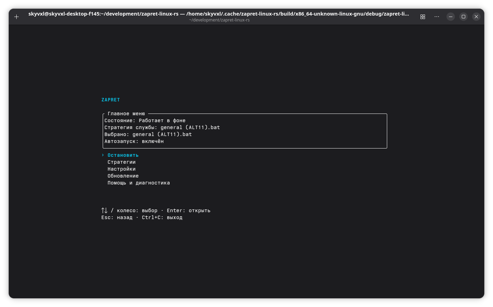
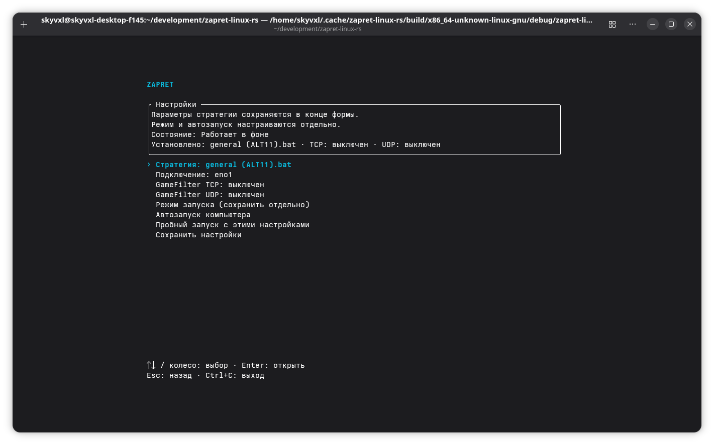
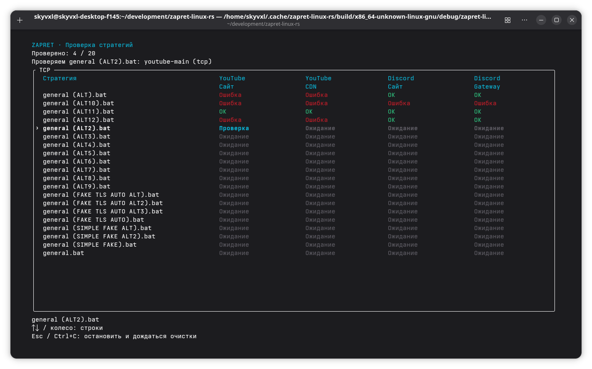
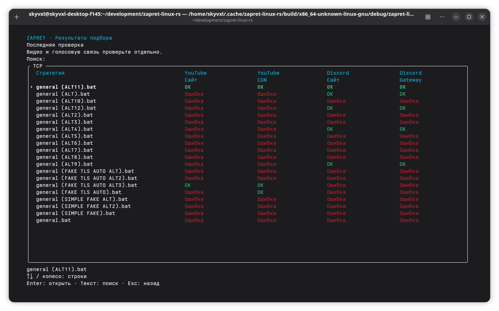

# zapret-linux-rs

Программа для запуска и настройки zapret на Linux.

Чтобы открыть меню, запусти в папке проекта:

```bash
./service.sh
```

При первом запуске выбери «Запустить». Мастер поможет подготовить данные, выбрать стратегию и режим: в терминале или в фоне. Автозапуск включается отдельно.

Управление: стрелки или колесо мыши, Enter для выбора, Esc для возврата. В списке стратегий просто печатай для поиска. Ctrl+C в меню закрывает его; во время действия останавливает worker и ждёт очистки. В терминалах без поддержки полноэкранного режима остаётся текстовое меню.

Если не знаешь, какую стратегию выбрать, запусти диагностику всех стратегий. Она проверит доступность сайтов с каждой из них. Из результатов можно сразу выбрать стратегию. Если служба уже работает, меню предложит временно остановить её и восстановит после проверки. Проверить видео и голосовую связь лучше отдельно.

Через то же меню можно обновить стратегии, изменить настройки, остановить или удалить службу. Настройки можно сохранить на потом или применить к службе. При ошибке применения программа пытается вернуть прежнюю конфигурацию; незавершённые операции доступны в разделе восстановления.

Открытие меню не требует sudo. Пароль может понадобиться для установки пакетов и действий со службой. Справка и краткое состояние:

```bash
./service.sh --help
./service.sh status
```

## Как выглядит

### Главное меню

Состояние службы, выбранная стратегия и автозапуск видны сразу. Отсюда можно запустить или остановить zapret и перейти к настройкам.



### Настройки

Выбор стратегии, сетевого подключения, GameFilter и режима запуска. Изменения можно сохранить на потом или сразу применить к службе.



### Проверка стратегий

Результаты появляются по мере проверки: отдельно для сайта YouTube, его CDN, сайта Discord и Gateway. По таблице можно перемещаться, пока остальные стратегии ещё проверяются.



### Результаты подбора

Стратегии, прошедшие все обязательные TCP-проверки, показаны первыми. Найди нужную поиском или стрелками и нажми Enter, чтобы выбрать её или посмотреть подробности.



## Основа проекта

Управление написано на Rust. Для обхода блокировок используется [zapret](https://github.com/bol-van/zapret), стратегии взяты из [проекта Flowseal](https://github.com/Flowseal/zapret-discord-youtube).
